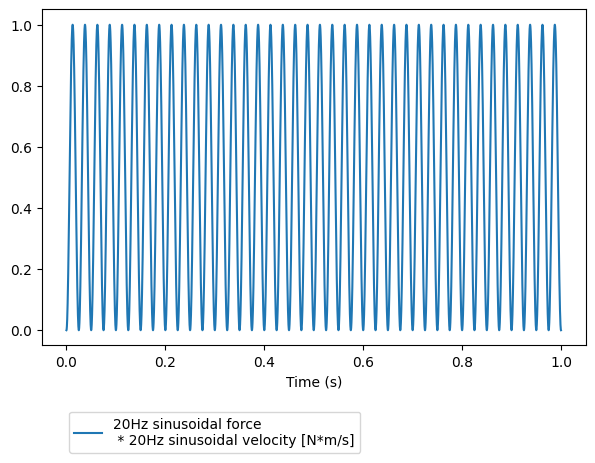
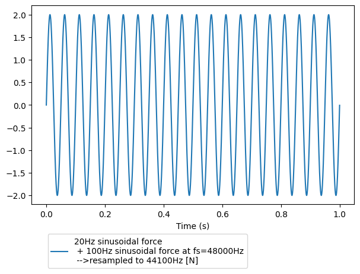

# Signals tutorial

The ```measpy.signal.Signal``` class describes a sampled temporal signal. It is at the core of the ```measpy.Measurement``` class, which helps in performing data acquisition with various daq cards.

An object of the class ```Signal``` is described by the following properties:

- A sampling frequency ```fs```
- A physical unit ```unit```
- A calibration ```cal``` in unit per Volt (if the signal comes from an DAQ acquisition)
- A multiplicative constant ```dbfs``` which express the voltage amplitude for which the acquired data equals 1 (one). This is a classical quantity when acquiring signals with audio cards, but can be ignored and kept at 1.0 with most data acquisition cards.
- A numpy array ```_rawvalues```, which corresponds to the raw data given by the digital acquisition process.
- A description ```desc``` (a string that describes the signal)
- A time shift ```_t0```
- Any other property can be added to a ```Signal``` object. It is saved and restored by the file management methods of this class.

Let's first import the measpy module, as well as numpy:


```python
#This is here in case we want to use the local measpy directory
import sys
sys.path.insert(0, "..")

import measpy as mp
import numpy as np
```

## 1. Basics

Let us create a signal ```S``` with a sampling frequency of 44100 Hz.

If ```unit```, ```calibration``` and ```dbfs``` are not specified they are defaulted to dimensionless, 1.0 and 1.0 respectively. And if no content is given the samples doesn't exist and ```_rawvalues``` equals ```None```.


```python
S = mp.Signal(fs=44100)
print(S)
print(S._rawvalues)
```

    measpy.Signal(cal=1.0,
    dbfs=1.0,
    desc='A signal',
    unit=dimensionless,
    fs=44100,
    _rawvalues=None,
    )
    None


As such, the above signal isn't very useful. Let us give to it some content, for instance a sinusoid at the frequency 100Hz of duration 1 second. ```raw``` property is a shortcut (@setter,@getter) for the property ```_rawvalues```.


```python
S.raw = np.sin(2*np.pi*20*np.arange(0,1,1/S.fs))
S.desc = 'A sinusoidal signal at 20Hz'
print(S.raw)
print(S._rawvalues)
```

    [ 0.          0.00284951  0.005699   ... -0.00854845 -0.005699
     -0.00284951]
    [ 0.          0.00284951  0.005699   ... -0.00854845 -0.005699
     -0.00284951]


Note that using S._rawvalues instead of S.raw would lead to the same result. More precisely the actual array is S._rawvalues, and S.raw is a shortcut (a @setter/@getter method).

Now that it contains data, the signal can be plotted.


```python

```


```python
S.plot()
```


    <AxesSubplot: xlabel='Time (s)'>


    

    


All what we have done before could be performed in one step at the initialization phase, as below.


```python
samplingfreq = 44100
S = mp.Signal(fs=samplingfreq,desc='20Hz sinusoidal signal',raw=np.sin(2*np.pi*20*np.arange(0,1,1/samplingfreq)))
S.plot()
```


    <AxesSubplot: xlabel='Time (s)'>


    

    


Even better, there is the sine method of the class Signal:


```python
S = mp.Signal.sine(freq=20,dur=1,fs=44100,amp=1)
```

There is a lot of additionnal properties for the signal. For instance, the duration and the time vector. These properties are not stored in memory. When asked for, they are calculated based on the number of samples in the signal, as in the example below:


```python
print(S.time)
print(S.dur)
```

    [0.00000000e+00 2.26757370e-05 4.53514739e-05 ... 9.99931973e-01
     9.99954649e-01 9.99977324e-01]
    1.0


## 2. Units

Let us now give a physical unit to this signal. Consider for instance that it is a velocity, in meter per second. In order to create such signal we have to additionnally specify the ```unit``` optionnal argument:


```python
velsig = mp.Signal.sine(fs=samplingfreq,freq=20.0,desc='20Hz sinusoidal velocity',dur=1.0,unit='m/s')
```

Consider a second signal, for instance a force in Newtons (N), in phase with the velocity. It is created in the same way:


```python
forcesig = mp.Signal.sine(fs=samplingfreq,freq=20.0,desc='20Hz sinusoidal force',dur=1.0,unit='N')
```

These two signal can be multiplied together, giving an instantaneous power!


```python
power = forcesig * velsig
power.plot()
```


    <AxesSubplot: xlabel='Time (s)'>


    

    


Note that by default, the units are simply multiplied together. It is however possible to ask for a standard unit of the same dimension for this signal. The below command will convert the signal to the standard unit for power (which is Watt)


```python
power = power.unit_to_std()
print(power)
```

    measpy.Signal(fs=44100,
    unit=W,
    cal=1.0,
    dbfs=1.0,
    desc='20Hz sinusoidal force
     * 20Hz sinusoidal velocity
     -->Unit to W',
    _rawvalues=[0.00000000e+00 8.11972599e-06 3.24786402e-05 ... 7.30759516e-05
     3.24786402e-05 8.11972599e-06],
    )


The ```similar``` method makes a copy of the Signal object and modifies its properties specified in its arguments. Using this method, we can do the same as before and change the description at the same time.


```python
power = (velsig*forcesig).unit_to_std().similar(desc='The power given to the system')
print(power)
```

    measpy.Signal(fs=44100,
    unit=W,
    cal=1.0,
    dbfs=1.0,
    desc='The power given to the system',
    _rawvalues=[0.00000000e+00 8.11972599e-06 3.24786402e-05 ... 7.30759516e-05
     3.24786402e-05 8.11972599e-06],
    )


Conversely to multiplication, in order to perform an addition, the signals have to be of compatible physical units. We cannot add force and velocity! The below command should raise an ```Exception```.


```python
forcesig+velsig
```


    ---------------------------------------------------------------------------

    Exception                                 Traceback (most recent call last)

    /home/doare/Documents/python/measpy/examples/1_signals_tutorial.ipynb Cell 28 in 1
    ----> <a href='vscode-notebook-cell:/home/doare/Documents/python/measpy/examples/1_signals_tutorial.ipynb#X32sZmlsZQ%3D%3D?line=0'>1</a> forcesig+velsig


    File ~/Documents/python/measpy/examples/../measpy/signal.py:988, in Signal.__add__(self, other)
        982 """Add something to the signal
        983 
        984 :param other: Something to add to
        985 :type other: Signal, float, int, scalar quantity
        986 """
        987 if type(other) == Signal:
    --> 988     return self._add(other)
        990 if (type(other) == float) or (type(other) == int) or (type(other) == complex) or isinstance(other, numbers.Number):
        991     # print('Add with a number without unit, it is considered to be of same unit')
        992     return self._add(
        993         self.similar(
        994             values=np.ones_like(self.values)*other,
        995             desc=str(other)
        996         )
        997     )


    File ~/Documents/python/measpy/examples/../measpy/signal.py:967, in Signal._add(self, other)
        958 """Add two signals
        959 
        960 :param other: Other signal to add
       (...)
        963 :rtype: Signal
        964 """
        966 if not self.unit.same_dimensions_as(other.unit):
    --> 967     raise Exception('Incompatible units in addition of sginals')
        968 if self.fs != other.fs:
        969     raise Exception(
        970         'Incompatible sampling frequencies in addition of signals')


    Exception: Incompatible units in addition of sginals


Added signals can have different dimensions if they are compatible. Let us create a signal in meter, a signal in decameter, add them, and finally plot the resulting signal.


```python
distance1 = mp.Signal(fs=samplingfreq,desc='A length',raw=np.sin(2*np.pi*100*np.arange(0,1,1/samplingfreq)),unit='m')
distance2 = mp.Signal(fs=samplingfreq,desc='Another length',raw=np.sin(2*np.pi*120*np.arange(0,1,1/samplingfreq)),unit='dam')
distancetot = distance1+distance2
distancetot.plot()
```


    <AxesSubplot: xlabel='Time (s)'>


    

    


When performing addition of signals, the final unit is that of the first operand. That's why we get meters in the above calculation. If we switch the signals, we get the same thing, but in decameters...


```python
distancetot = distance2+distance1
distancetot.plot()
```


    <AxesSubplot: xlabel='Time (s)'>


    

    


We might want to convert this to millimeters... There is a method for that.


```python
distancetot.unit_to('mm').plot()
```


    <AxesSubplot: xlabel='Time (s)'>


    

    


Any operation on signals necessitates that the operands are signals of same length and frequency. For instance, consider a for signal of different sampling frequency, and try to add it to the previous force signal. This should give us an error.


```python
samplingfreq2=48000
forcesig2 = mp.Signal.sine(fs=samplingfreq2,freq=20.0,dur=1.0,desc='100Hz sinusoidal force at fs=48000Hz',unit='N')
forcetot = forcesig+forcesig2
```


    ---------------------------------------------------------------------------

    Exception                                 Traceback (most recent call last)

    /home/doare/Documents/python/measpy/examples/1_signals_tutorial.ipynb Cell 36 in 3
          <a href='vscode-notebook-cell:/home/doare/Documents/python/measpy/examples/1_signals_tutorial.ipynb#X43sZmlsZQ%3D%3D?line=0'>1</a> samplingfreq2=48000
          <a href='vscode-notebook-cell:/home/doare/Documents/python/measpy/examples/1_signals_tutorial.ipynb#X43sZmlsZQ%3D%3D?line=1'>2</a> forcesig2 = mp.Signal.sine(fs=samplingfreq2,freq=20.0,dur=1.0,desc='100Hz sinusoidal force at fs=48000Hz',unit='N')
    ----> <a href='vscode-notebook-cell:/home/doare/Documents/python/measpy/examples/1_signals_tutorial.ipynb#X43sZmlsZQ%3D%3D?line=2'>3</a> forcetot = forcesig+forcesig2


    File ~/Documents/python/measpy/examples/../measpy/signal.py:988, in Signal.__add__(self, other)
        982 """Add something to the signal
        983 
        984 :param other: Something to add to
        985 :type other: Signal, float, int, scalar quantity
        986 """
        987 if type(other) == Signal:
    --> 988     return self._add(other)
        990 if (type(other) == float) or (type(other) == int) or (type(other) == complex) or isinstance(other, numbers.Number):
        991     # print('Add with a number without unit, it is considered to be of same unit')
        992     return self._add(
        993         self.similar(
        994             values=np.ones_like(self.values)*other,
        995             desc=str(other)
        996         )
        997     )


    File ~/Documents/python/measpy/examples/../measpy/signal.py:969, in Signal._add(self, other)
        967     raise Exception('Incompatible units in addition of sginals')
        968 if self.fs != other.fs:
    --> 969     raise Exception(
        970         'Incompatible sampling frequencies in addition of signals')
        971 if self.length != other.length:
        972     raise Exception('Incompatible signal lengths')


    Exception: Incompatible sampling frequencies in addition of signals


But we can try to resample one signal to match the sampling frequency of the orther. If the two signals are of same length after one is resampled to match the other, this will work...


```python
forcetot = forcesig+forcesig2.resample(forcesig.fs)
forcetot.plot()
```


    <AxesSubplot: xlabel='Time (s)'>


    

    


## 3. Calibrations

Up to now, we didn't care about calibration. In fact, if we worked only with such synthesized signal, there wouldn't be any reason to.

Most of the time, these signals come from data acquisition process, where an accelerometer, a force/torque sensor, a microphone or an optical velocity measurement device is involved.

Conditionners generally produce a voltage signal that is proportionnal to the measured quantity. The calibration ```cal``` is hence a float number which in expressed in Volts/units.

The data acquisition device the captures this voltage signal at a given sampling frequency. If the acquired samples directly express the voltage input, ```dbfs=1```. With some devices (for instance line inputs of sound cards), the acquired sample values are proportionnal, but not equal. The coefficient of proportionnality is ```dbfs```.

The true signal expressed in unit is hence given by multiplying the ```_rawvalues``` property by dbfs (to convert it in volts) and dividing the resulting array by ```cal```.

There are methods for that.


Consider the signal below. A sinusoidal velocity. The calibration was 2V/(m/s) and the input measures 1.0 when there is 5 incoming Volts.


```python
velsig = mp.Signal(fs=samplingfreq,
    desc='100Hz sinusoidal velocity',
    raw=np.sin(2*np.pi*100*np.arange(0,1,1/samplingfreq)),
    unit='m/s',
    cal=2.0,
    dbfs=5.0)
```

The raw values given by the sound card are accessed by using the ```_rawvalues``` property or ```raw```, which is a shortcut method, and is preferrable.


```python
velsig.raw
```


    array([ 0.        ,  0.0142471 ,  0.02849132, ..., -0.04272974,
           -0.02849132, -0.0142471 ])


We might want for some reason the actual voltage that was going into the daq card.


```python
velsig.volts
```


    array([ 0.        ,  0.07123552,  0.14245658, ..., -0.21364872,
           -0.14245658, -0.07123552])


The measured values in m/s are accessed using the ```values``` property... And this is what is plotted when we use the ```velsig.plot()``` method.


```python
print(velsig.values)
velsig.plot()
```

    [ 0.          0.03561776  0.07122829 ... -0.10682436 -0.07122829
     -0.03561776]


    <AxesSubplot:xlabel='Time (s)'>


    

    


We have seen that velsig.volts returns a numpy array with the actual acquired voltages. In cas we need that in the form of a Signal, there is the as_volts() method:


```python
velsig.as_volts()
```


    measpy.Signal(fs=44100,
    unit=V,
    cal=1.0,
    dbfs=1.0,
    desc='20Hz sinusoidal velocity
     -->Voltage',
    _rawvalues=[ 0.          0.00284951  0.005699   ... -0.00854845 -0.005699
     -0.00284951],
    )


There is also the as_raw() method of course.

## 4. File I/O

The preferred format for saving a ```Signal``` object is a combination of a CSV file for the properties and a WAV file for the data. Simply use the method ```to_csvwav```, which takes a string as argument.


```python
velsig.to_csvwav('velocity')
```

The above command creates the files velocity.csv and velocity.wav.

To load it again, use the @classmethod ```from_csvwav```, as below:


```python
vel = mp.Signal.from_csvwav('velocity')
vel.plot()
```


    <AxesSubplot:xlabel='Time (s)'>


    

    


There is also a ```from_wav``` @classmethod which allows to import a WAV file. As only the data and the sampling frequency are stored in a WAV file, the other properties have to be specified as optionnal named parameters if necessary (unit,calibrations, etc.)


```python
vel = mp.Signal.from_wav('velocity.wav',unit='m/s',desc='This is a velocity')
```


```python

```
