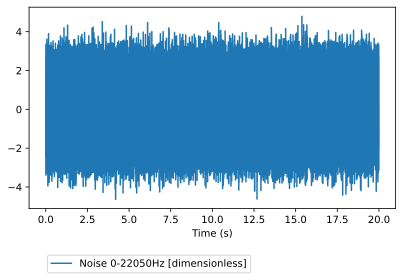
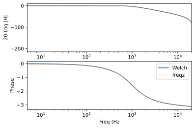
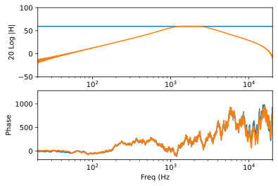
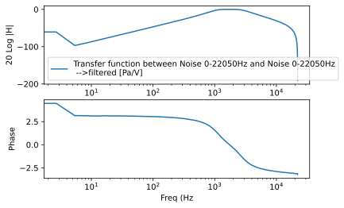

# Tutorial 2: measpy.Spectral class

The ```measpy.Spectral``` allows to do Fourier analyses on signals.

An object of the ```Spectral``` type contains the following maing properties:
- ```fs``` : a sampling frequency (int)
- ```desc``` : a description (string)
- ```unit``` : a physical unit (unyt.Unit)
- ```values``` : a 1D array (float) containing the values of the Fourier spectrum
- ```full``` : a boolean value indicating if the spectrum values are given up to the sampling frequency ```fs``` or the Nyquist frequency ```fs/2``` 


```python
#This is here in case we want to use the local measy directory
#import sys
#sys.path.insert(0, "..")

import measpy as mp
import numpy as np
import matplotlib.pyplot as plt
```

Let us create a white noise signal of duration 5 seconds, with the sampling frequency ```fs```=44100 Hz


```python
noise = mp.Signal.noise(freqs=[0,22050],fs=44100,dur=20)
print(noise)
noise.plot()
```

    measpy.Signal(fs=44100, desc='Noise 0-22050Hz', cal=1.0, unit='dimensionless', dbfs=1.0)


    <AxesSubplot:xlabel='Time (s)'>





Let us now filter this noise using the method ```Signal.iir```, which is basically a wrapper function around ```scipy.signal.filter.iirfilter``` and ```scipy.signal.filter.sosfilt```.

Below, the white noise is filtered between 1000 and 2000 Hz using a 6th-order butterworth filter (default type)


```python
noisef = noise.iir(N=2,Wn=1000,btype='lowpass',ftype='butter')
```

We now calculate and plot the FFT

As the signal is real valued, it is fair to use the rfft, which only returns the (complex) values of the FFT up to the Nyquist frequency.

rfft is a method of ```measpy.Signal``` class, that returns an object of the ```measpy.Spectral``` class

By default, with no arguments, the plot method of the ```Spectral``` class plots the dB amplitude (ref. unity) and phase, with logarithmic frequency scale, and returns an array of two axes.


```python
noisesp = noisef.rfft()
print(noisesp)
noisesp.plot()
```

    <measpy.signal.Spectral object at 0x7f448a9e9fa0>


    array([<AxesSubplot:xlabel='Freq (Hz)', ylabel='20 Log |H|'>,
           <AxesSubplot:xlabel='Freq (Hz', ylabel='Phase'>], dtype=object)


The ```measpy.Spectral.irfft``` method allows to go back the time domain...


```python
noisesp.irfft().plot()
```


    <AxesSubplot:xlabel='Time (s)'>


To commpute the frequency response of the filter, we can use Welch's method for transfer function estimation.

Let us do this and compare with the "theoretical" frequency response given by ```scipy.signal.sosfreqz```


```python
sp = noisef.tfe_welch(noise,nperseg=2**14)
ax = sp.plot(label='Welch')

from scipy.signal import iirfilter, sosfreqz

sos = iirfilter(N=2,Wn=1000,btype='lowpass',fs=noise.fs,output='sos',ftype='butter')
f,h = sosfreqz(sos,fs=noise.fs)
ax[0].plot(f,20*np.log10(abs(h)),label='freqz',ls=':')
ax[0].set_xlim([5,20000])
ax[1].plot(f,np.unwrap(np.angle(h)),label='freqz',ls=':')
ax[1].set_xlim([5,20000])
ax[1].legend()

```


    <matplotlib.legend.Legend at 0x7f448b272ee0>





## Units

Units are preserved during all the spectral/signal analyses.

To illustrate this, let us create a noise signal, in Volts, and another one in Pascals, and do some Fourier analyses with these signals.


```python
# voltage signal
voltage = mp.Signal.noise(freqs=[0,22050],fs=44100,dur=20).similar(unit='V')

# Consider the pressure we have measured is linearly dependent
# on the voltage. In this example it is done with a filter, for
# instance a bandpass
pressure = voltage.iir(N=2,Wn=[1000,3000],btype='bandpass',ftype='butter').similar(unit='Pa')

v_fft = voltage.rfft()
p_fft = pressure.rfft()

print(v_fft.unit)
print(p_fft.unit)

a=v_fft.plot()
p_fft.plot(ax=a)
a[0].set_xlim([20,20000])
a[0].set_ylim([-50,100])
a[1].set_xlim([20,20000])

```

    V
    Pa


    (20, 20000)





Welch's method for transfer function preserves units, as illustrated with the command below, which computes the transfer function between voltage and pressure. The resulting spectral data should have the dimension 'Pa/V'.


```python
tf=pressure.tfe_welch(voltage,nperseg=2**14)
print(tf.unit)
a=tf.plot()
a[0].legend()
```

    Pa/V


    <matplotlib.legend.Legend at 0x7f448b3b8cd0>





Spectral object can be added, multiplied, divided, etc., provided they have compatible sampling frequency, duration and units.

For instance, it is not allowed to add voltage and pressure spectra. This should raise an Exception.


```python
v_fft+p_fft
```


    ---------------------------------------------------------------------------

    Exception                                 Traceback (most recent call last)

    <ipython-input-45-f71d479f840d> in <module>
    ----> 1 v_fft+p_fft
    

    ~/Documents/python/measpy/measpy/signal.py in __add__(self, other)
       1156         """
       1157         if type(other)==Spectral:
    -> 1158             return self._add(other)
       1159 
       1160         if (type(other)==float) or (type(other)==int):


    ~/Documents/python/measpy/measpy/signal.py in _add(self, other)
       1136 
       1137         if not self.unit.same_dimensions_as(other.unit):
    -> 1138             raise Exception('Incompatible units in addition of Spectral obk=jects')
       1139         if self.fs!=other.fs:
       1140             raise Exception('Incompatible sampling frequencies in addition of Spectral objects')


    Exception: Incompatible units in addition of Spectral obk=jects


It is however possible to multiply them (even if the reason to do this is questionnable...). The units are preserved during the operations


```python
prod = v_fft*p_fft
print(prod.unit)

```

    Pa*V


When going back to time domain, the units are also preserved. For instance, we could compute the Green's function of our LTI system that transforms voltage to pressure, whose transfer function has already been estimated previously (```tf``` ```Spectral``` object).

As should appear in the plot below, the dimension of the Green's function is now Pa/V


```python
G=tf.irfft()
G.plot()
```


    <AxesSubplot:xlabel='Time (s)'>


```python

```
